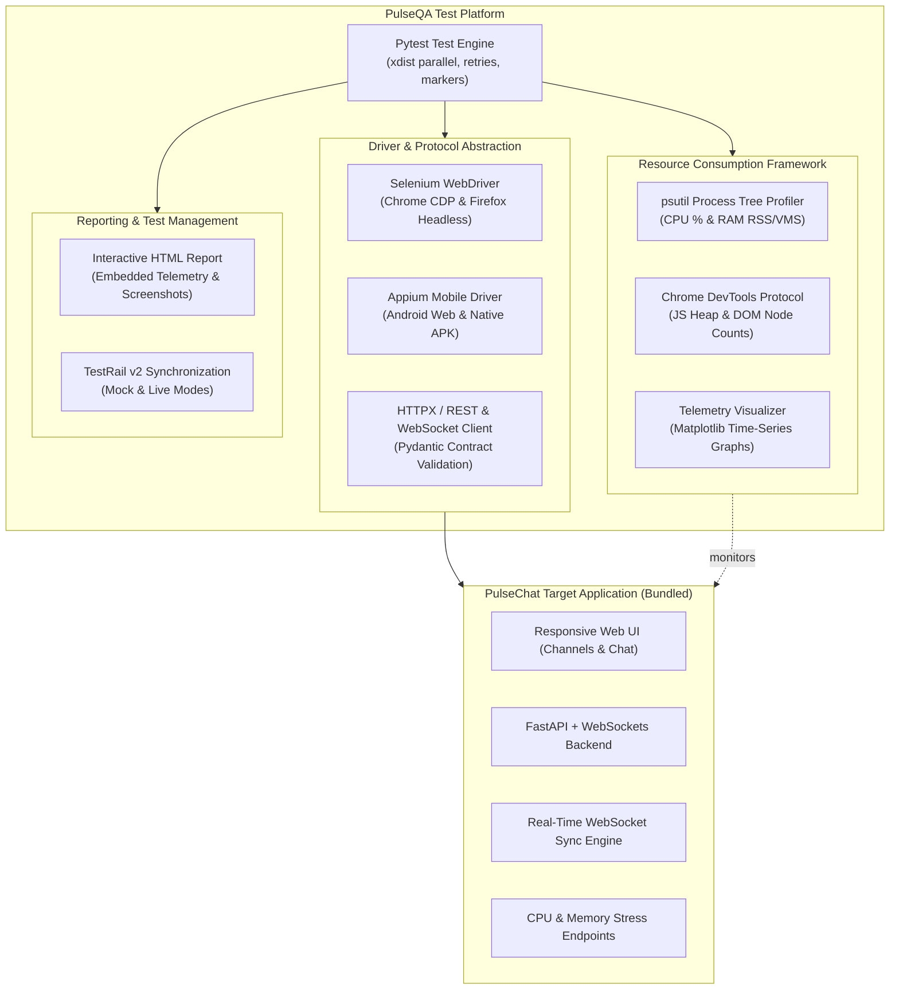
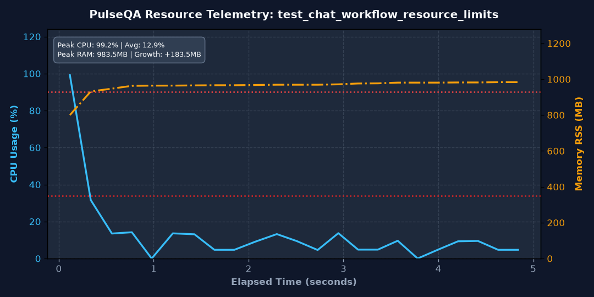

# PulseQA: Enterprise Cross-Platform Test Automation & Resource Telemetry Platform

<div align="center">


**A production-grade, multi-platform test automation platform and real-time hardware telemetry profiler designed to validate Web, Mobile, REST/WebSocket APIs, and browser resource consumption.**

</div>

---

## 🎯 Resume & Competency Alignment Matrix

| Resume Experience Highlight | Implemented Architecture & Codebase Component |
| :--- | :--- |
| **Python Test Automation Platform (Selenium, Appium, Pytest)** | Unified Pytest framework driving Selenium (`core/drivers/web_driver_factory.py`), Appium (`core/drivers/mobile_driver_factory.py`), Page Object Models (`pages/`), and robust explicit waits (`pages/base_page.py`). |
| **Resource Consumption Framework (Browser CPU & Memory)** | Autonomous background telemetry engine (`telemetry/monitor.py`), Chrome DevTools Protocol metrics extractor (`telemetry/cdp_metrics.py`), SLA threshold assertions (`telemetry/thresholds.py`), and telemetry chart visualizer (`telemetry/visualizer.py`). |
| **Real-Time WebSocket & REST Messaging Engine** | End-to-end multi-channel communication verification, validating token-based authentication, WebSocket state synchronization, broadcast integrity, and Pydantic response contract validation (`tests/api/test_chat_api.py`, `tests/web/test_chat_messaging.py`). |
| **CI/CD Test Orchestration & TestRail Integration** | Declarative multi-stage `Jenkinsfile`, GitHub Actions workflow (`.github/workflows/ci.yml`), Docker containerization (`ci/Dockerfile`), and custom Pytest TestRail sync plugin (`integrations/testrail/`). |
| **CEF CVE Triage & SPDX License Compliance Pipeline** | Automated SPDX 2.3 JSON Software Bill of Materials (SBOM) generator (`security_compliance/spdx_generator.py`) and vulnerability advisory triage scanner (`security_compliance/cve_checker.py`). |
| **Regression Optimization (2h vs 2+ Days)** | Parallel test execution with dynamic port allocation, zero-sleep explicit wait strategies, session-scoped backend daemon, and headless execution grids. |

---

## 🏛️ High-Level Architecture



---

## ⚡ Key Highlights & Capabilities

### 1. Real-Time Resource Consumption Framework
Directly reproducing the production resource monitoring system:
- **Continuous Sampling**: Samples CPU utilization, RAM RSS, VMS, and thread count across the entire browser and application process tree at 200ms intervals.
- **Chrome DevTools Protocol (CDP)**: Hooks directly into Chrome's V8 engine to query internal metrics (`JSHeapUsedSize`, `Nodes`, `LayoutCount`, `TaskDuration`).
- **SLA Assertions**: Automated threshold verification (`assert_resource_limits(result, max_avg_cpu_pct=85.0, max_ram_mb=1500.0)`).
- **Visual Telemetry Curves**: Automatically generates dual-axis time-series plots saved to `reports/telemetry/` and linked to test reports.

### 2. Multi-Platform Automation (Web, Mobile, API)
- **Web UI**: Page Object Model with synchronized explicit waits and screenshot capture on failure.
- **Mobile UI**: Appium Android driver factory supporting Chrome mobile browser, native applications, and offline CI/CD mock sessions.
- **API Engine**: Synchronous and asynchronous HTTPX client validating request schemas, auth tokens, and WebSocket streams.

### 3. Real-Time Communication & Contract Testing
- Validates bidirectional WebSocket synchronization and instant message broadcast across concurrent channels.
- Pydantic contract validation verifying schema stability across authentication, messaging, and health telemetry endpoints.

### 4. Enterprise Test Management (TestRail v2)
- Inspects `@pytest.mark.testrail(case_id=...)` decorators.
- Dynamically creates test runs, uploads pass/fail execution states, records duration, and attaches error stacktraces.
- Built-in **Mock Mode** allows full verification in local or CI environments without requiring paid SaaS credentials.

### 5. Security & License Compliance
- **SPDX 2.3 SBOM Generator**: Scans active dependencies and produces an SPDX-standard Software Bill of Materials in JSON format.
- **CVE Advisory Scanner**: Audits browser engine components and third-party dependencies against vulnerability advisories.

---

## 📂 Repository Structure

```plaintext
qa_framework/
├── .github/workflows/
│   └── ci.yml                 # GitHub Actions multi-platform workflow
├── ci/
│   ├── Dockerfile             # Containerized test runner with headless Chrome
│   ├── docker-compose.yml     # Standalone Docker Compose execution grid
│   └── Jenkinsfile            # Multi-stage declarative Jenkins pipeline
├── core/
│   ├── config.py              # Pydantic Settings and environment configuration
│   ├── exceptions.py          # Custom exception hierarchy
│   ├── locators/              # Centralized element selectors (By tuples)
│   │   ├── login_locators.py
│   │   ├── chat_locators.py
│   │   └── settings_locators.py
│   └── drivers/
│       ├── web_driver_factory.py    # Chrome (CDP enabled) & Firefox Selenium drivers
│       └── mobile_driver_factory.py # Appium Android & Mock driver
├── pages/                     # Page Object Model (POM) Layer
│   ├── base_page.py           # Robust explicit waits, interactions & screenshot hooks
│   ├── login_page.py          # Authentication POM
│   ├── chat_page.py           # Multi-room chat & stress trigger POM
│   └── settings_page.py       # Diagnostics and telemetry POM
├── api/                       # API Test Layer
│   ├── client.py              # HTTPX REST & WebSocket client
│   └── schemas.py             # Pydantic contract validation models
├── telemetry/                 # Resource Consumption Framework
│   ├── monitor.py             # psutil process tree CPU & RAM sampling
│   ├── cdp_metrics.py         # Chrome DevTools Protocol engine metrics extractor
│   ├── thresholds.py          # SLA assertion engine
│   └── visualizer.py          # Matplotlib time-series telemetry curve plotter
├── integrations/testrail/     # Enterprise TestRail Integration
│   ├── client.py              # TestRail v2 API client (Live & Mock modes)
│   └── plugin.py              # Pytest hook for automatic run creation and sync
├── security_compliance/       # Security & Compliance
│   ├── spdx_generator.py      # SPDX 2.3 SBOM JSON generator
│   └── cve_checker.py         # CVE vulnerability audit scanner
├── target_app/                # Self-Contained Target Application (PulseChat)
│   ├── app.py                 # FastAPI backend, WebSockets, & stress simulation
│   ├── templates/             # Responsive HTML5 chat UI
│   └── static/                # Modern CSS dark theme & client JavaScript
├── tests/                     # Automated Test Suites
│   ├── conftest.py            # Global fixtures (dynamic port, drivers, telemetry)
│   ├── api/                   # REST & WebSocket API contract tests
│   ├── web/                   # Selenium Web UI POM regression tests
│   ├── mobile/                # Appium Android & responsive tests
│   └── performance/           # Hardware telemetry & SLA assertion tests
├── reports/                   # Test reports, screenshots, and telemetry charts
├── pytest.ini                 # Pytest configuration & custom markers
├── pyproject.toml             # Ruff linter configuration
├── requirements.txt           # Framework dependencies
└── README.md
```

---

## 🚀 Quickstart Guide

### 1. Prerequisites
- Python 3.10+ (tested on Python 3.12)
- Google Chrome or Chromium (for Selenium Web tests)

### 2. Setup Virtual Environment
```bash
# Clone the repository
git clone https://github.com/ahmed-khalifa/qa_framework.git
cd qa_framework

# Create and activate virtual environment
python3 -m venv .venv
source .venv/bin/activate

# Install dependencies
pip install -r requirements.txt
```

### 3. Run the Entire Test Suite
The target application starts automatically in the background on a dynamic available port—zero manual setup required:

```bash
# Run all automated tests (API, Web, Mobile, Performance)
pytest -v
```

### 4. Run Targeted Test Suites
```bash
# Run only Fast API & Contract tests
pytest tests/api -v

# Run only Web UI Page Object Model tests
pytest tests/web -v

# Run only Mobile Appium tests
pytest tests/mobile -v

# Run only Resource Telemetry & Performance tests
pytest tests/performance -v -s

# Run tests by custom markers
pytest -m smoke -v
pytest -m regression -v
```

### 5. Inspect Reports & Telemetry Charts
- **Interactive HTML Report**: Open `reports/test_report.html` in your browser.
- **Hardware Telemetry Curves**: Check `reports/telemetry/*.png` to view CPU and RAM consumption curves recorded during test execution.
- **Failure Screenshots**: If any UI test fails, full-page screenshots are saved to `reports/screenshots/`.

---

## 📊 Sample Telemetry Curve

When `@pytest.mark.performance` tests execute, the `ResourceMonitor` tracks the process tree and produces high-resolution plots:

<div align="center">
  
</div>

- **Left Axis (Cyan)**: Real-time CPU Utilization (%) across the full browser process tree.
- **Right Axis (Orange)**: Resident Set Size (RSS) Memory in Megabytes over elapsed time.
- **Metadata Card**: Auto-calculated Peak CPU, Average CPU, Peak RAM, and Memory Growth delta for leak detection.

---

## 📈 Allure Interactive Test Reporting

PulseQA integrates with `allure-pytest` to generate interactive test dashboards with embedded hardware telemetry graphs and failure screenshots.

```bash
# Generate and open the interactive Allure Dashboard
allure serve reports/allure-results
```

Features included in Allure:
- Categorized Epics: **PulseChat API**, **PulseChat Web UI**, **PulseChat Mobile**, and **Hardware Telemetry**.
- Embedded dual-axis CPU/RAM charts attached directly to test results.
- Full-page failure screenshots on UI assertion breaches.

---

## 🔒 Security & SBOM Compliance Execution

Generate the SPDX 2.3 Software Bill of Materials (SBOM) and run vulnerability triage:

```bash
# Generate SPDX 2.3 SBOM JSON
python security_compliance/spdx_generator.py
# Output: reports/compliance/pulseqa_sbom.spdx.json

# Run CVE Vulnerability Triage
python security_compliance/cve_checker.py
# Output: reports/compliance/cve_triage_report.json
```

---

## 🚢 CI/CD & Docker Orchestration

### Run via Docker
```bash
# Build and execute inside containerized headless Chrome grid
docker compose -f ci/docker-compose.yml up --build
```

### Jenkins Pipeline
The included `ci/Jenkinsfile` provides a 5-stage declarative pipeline:
1. **Environment Preparation**: Virtualenv setup and dependency installation.
2. **Linting**: Static analysis with `ruff`.
3. **Security & SPDX Compliance**: Automated SBOM generation and CVE audit.
4. **Parallel Execution**: Concurrent execution of API, Web, Mobile, and Performance suites.
5. **Reporting & TestRail Sync**: Test results posted to TestRail and artifacts archived.

---

## 📄 License
This project is open-source under the MIT License.
